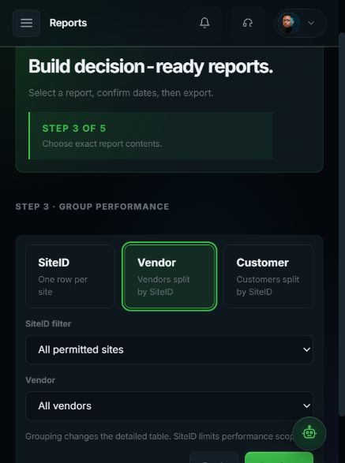
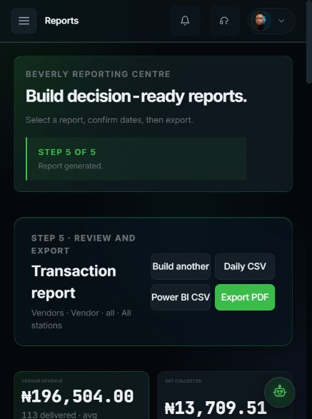
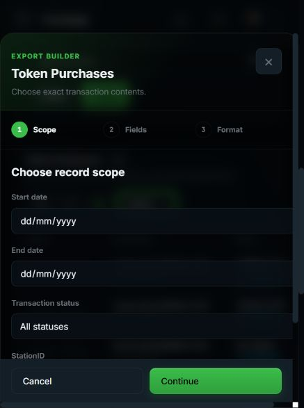
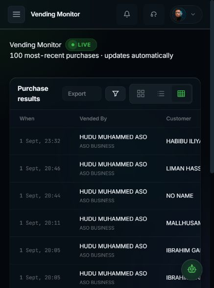
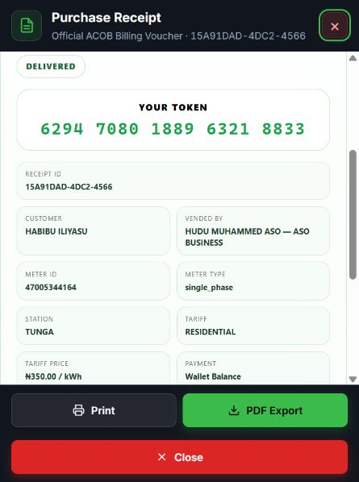
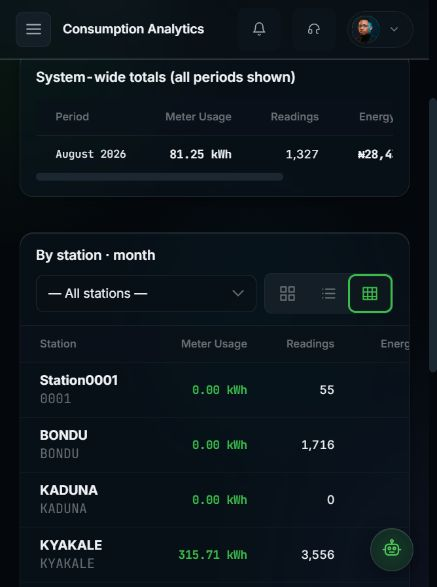
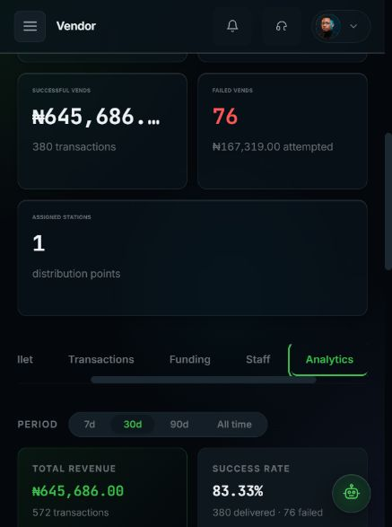
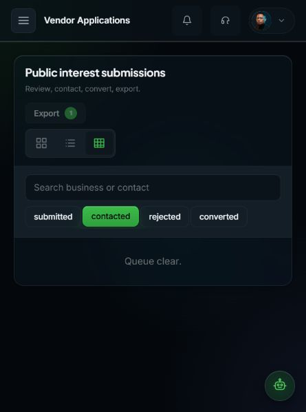

# Beverly Wallet Export Audit

## Health

| Area | Result | Evidence |
|---|---|---|
| Full workspace build | Pass | All six builds passed. |
| Type checks | Pass | Workspace checks passed. |
| Export contracts | Pass | Export tests passed. |
| Report contracts | Pass | Breakdown tests passed. |
| Receipt identity | Pass | Identity tests passed. |
| Migration contracts | Pass | Migration tests passed. |
| Mobile layout | Pass | Verified at 445×598. |
| Live report generation | Pass | Seven-day report generated. |
| Live vendor analytics | Pass | Real analytics rendered. |
| Live receipt identity | Pass | Exact operator rendered. |

## Verified Flow

| Comment | Gap | Implemented result | Verification |
|---|---|---|---|
| 1 | Static report templates | Five-step report builder | Live browser passed. |
| 2 | Missing vending identity | Added operator and business | Live rows passed. |
| 3 | Missing monitor identity | Added identity-first column | Live rows passed. |
| 4 | Missing monitor pagination | Shared 10/20/50/100 control | Live control passed. |
| 5 | Broken applications layout | Responsive command surface | Mobile view passed. |
| 6 | Missing review workflow | Added status actions | Route contracts passed. |
| 7 | Combined vend outcomes | Split successful and failed | Live KPIs passed. |
| 8 | Oversized vendor details | Compact details grid | Mobile view passed. |
| 9 | Weak wallet table controls | Shared filters and pagination | Component checks passed. |
| 10 | Weak transaction controls | Shared filters and pagination | Component checks passed. |
| 11 | Missing funding channels | Split Paystack and bank | Live KPIs passed. |
| 12 | Weak funding controls | Shared filters and pagination | Component checks passed. |
| 13 | Analytics unavailable | Added vendor analytics route | Live analytics passed. |
| 14 | Generic vendor export | Page-specific export wizard | Wizard checks passed. |
| 15 | Missing report scopes | Added sites and vendors | Live builder passed. |
| 16 | Incorrect receipt operator | Resolved exact operator | Live receipt passed. |
| 17 | Incorrect purchase way | Added portal-specific wording | Live receipt passed. |
| 18 | Wallet UUID displayed | Added wallet-owner name | Live receipt passed. |
| 19 | Missing vending page sizes | Shared page-size selector | Live control passed. |
| 20 | Missing consumption table | Added table/list switching | Mobile table passed. |

## Export Scope

- Start and end dates.
- Success and failure states.
- Every transaction state.
- All stations or one.
- Every vendor or one.
- Every customer or one.
- Selectable export fields.
- CSV and PDF formats.
- Full filtered datasets.
- Hover scope previews.

## Report Scope

- Financial report selection.
- Transaction report selection.
- Vendor wallet selection.
- Audit report selection.
- Disputes report selection.
- General report selection.
- Combined ownership scope.
- Vendor ownership scope.
- Customer ownership scope.
- SiteID performance grouping.
- Vendor performance grouping.
- Customer performance grouping.
- Exact entity selection.
- All transaction outcomes.
- Successful transactions only.
- Failed transactions only.
- Daily CSV exports.
- Power BI CSV exports.
- PDF report exports.

## Identity Integrity

- Operator name appears first.
- Business name follows immediately.
- StationID remains explicit.
- Customer identity stays separate.
- Wallet names replace UUIDs.
- Purchase paths stay explicit.
- Reports expose separate columns.
- Power BI receives identities.

## Resilience

- Missing RPC uses fallback.
- Export CSV blocks formulas.
- Export fields escape content.
- Empty states remain clear.
- Failed reports show retries.
- Filters reset pagination safely.
- Mobile tables remain scrollable.
- Focus styles remain visible.

## Screenshots

### Report Builder

### Report Review

### Export Wizard

### Vending Identity

### Receipt Identity

### Consumption Table

### Vendor Analytics

### Applications Layout

## Deployment Note

- Database migrations remain deployable.
- Runtime fallback already operates.
- Migration deployment improves indexing.
