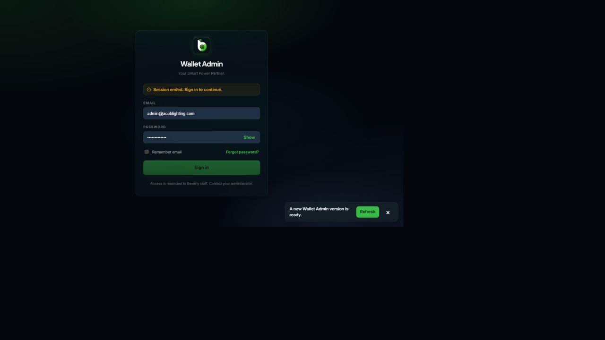

# Wallet Export Audit

## Audit scope

- Admin wallets were reviewed.
- Vendor wallets were reviewed.
- Customer wallets were reviewed.
- Export paths were traced.
- Shared logic was inspected.
- Loading states were inspected.
- Empty states were inspected.
- Error states were inspected.
- Accessibility patterns were inspected.

## Previous gaps

- Export coverage stayed inconsistent.
- Customer exports were missing.
- Vendor exports stayed partial.
- Admin exports stayed fragmented.
- Helpers duplicated export logic.
- Formula injection remained possible.
- PDF handling stayed inconsistent.
- Export status stayed invisible.
- Regression coverage was absent.
- Development startup was broken.

## Implemented experience

- Shared export utilities added.
- Shared menu component added.
- CSV exports use BOM.
- CSV values escape safely.
- Formula payloads get neutralized.
- PDF documents print cleanly.
- Popup failures show clearly.
- Empty exports stay disabled.
- Loading exports stay disabled.
- Export counts remain visible.
- Filtered rows export correctly.
- Filenames include stable timestamps.
- Menus support keyboard dismissal.
- Status updates use announcements.
- Existing tokens remain reused.

## Coverage result

- Admin operations gain exports.
- Vendor records gain exports.
- Customer records gain exports.
- Detail tabs export contextually.
- Support sections export separately.
- Analytics sections export independently.
- Privileged configuration stays excluded.

## Verification result

- Full production build passed.
- Admin typechecking passed.
- Vendor typechecking passed.
- Customer typechecking passed.
- Export regression tests passed.
- Development helper tests passed.
- Diff validation passed cleanly.

## Browser evidence

### Admin login wall

### Vendor login wall

### Customer login wall

## Evidence limitation

- Authentication requires user confirmation.
- Credentials remained masked throughout.
- Authenticated exports stayed untested.
- Code-level coverage passed fully.
