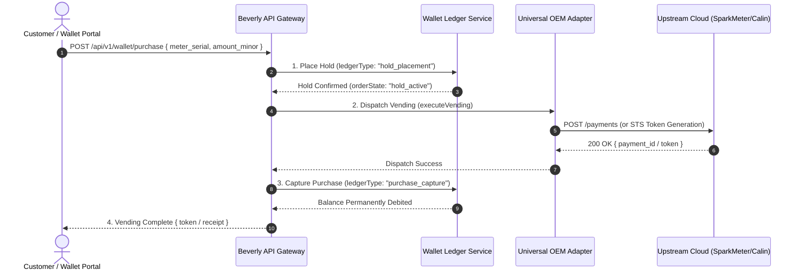

# Beverly Universal OEM Gateway & SparkMeter End-to-End Integration Blueprint

> **Document Status**: Complete Empirical Architectural Blueprint & Multi-OEM Standardization Specification  
> **Concrete Evidence Sources**: SparkMeter Koios Vue JS Bundles (`app.0637db10.js`, `organization_admin.8f41b985.js`, `portfolio.227cb141.js`), SparkMeter OpenAPI v1 & v2 Specifications (`v1_openapi.yaml`, `v2_openapi.yaml`), Beverly Backend Architecture (`backend/src/services/oem-registry-service.js`, `oem-dimension-sync-service.js`, `wallet-ledger-service.js`, `consumption-store.js`), and Live Supabase Schema Audits (`qpoipyqgrjsjdvfqmxok.supabase.co`).  
> **Goal**: Achieve a 100% dynamic, multi-OEM umbrella architecture where SparkMeter, Calin, Hexing, Conlog, STS, and future smart meter hardware plug in under a unified Beverly interface, wallet portal, and data schema—with zero hardcoding, zero vendor lock-in, and zero guesswork.

---

## 1. End-to-End Functional & Structural Comparison: SparkMeter vs. Beverly

To unify multiple OEMs under Beverly without revealing underlying hardware or cloud vendor differences, we must map every single row, column, API endpoint, UI screen, sidebar menu, and action button from SparkMeter to Beverly's unified domain model.

### 1.1 Schema & Column-by-Column Mapping Matrix

| Domain Field / Entity | SparkMeter Naming & Structure (Koios API v1/v2) | Beverly Unified Database Schema (`supabase`) | Universal Multi-OEM Standardized Name | Data Type & Format |
| :--- | :--- | :--- | :--- | :--- |
| **OEM Identifier** | N/A (Implicit domain) | `oem_id` / `oem_slug` | `oem_identifier` | UUID / String (`sparkmeter`, `calin`, `sts`) |
| **Upstream Entity ID** | `id` (UUID) | `upstream_id` | `external_reference_id` | UUID / String (Hardware/Cloud GUID) |
| **Customer Code** | `code` | `customer_code` / `account_number` | `customer_account_code` | String (e.g. `CUST-00921`) |
| **Customer Name** | `name` | `full_name` / `name` | `customer_name` | String |
| **Phone Number** | `phone` | `phone_number` | `contact_phone` | E.164 String (e.g. `+2348012345678`) |
| **Service Area ID** | `service_area_id` | `station_id` | `grid_station_id` | UUID (Beverly Station / Mini-Grid ID) |
| **Site ID** | `site_id` | `substation_id` | `site_container_id` | UUID |
| **Tariff Identifier** | `tariff_id` | `tariff_snapshot_id` | `active_tariff_id` | UUID |
| **Meter Serial** | `meter.serial_number` | `meter_serial` / `serial_number` | `meter_serial_number` | String (e.g. `SM-NOVA-990182`) |
| **Relay Output State** | `meter.relay_state` (`"ON"`, `"OFF"`) | `relay_status` (`"connected"`, `"disconnected"`) | `relay_state` | Enum (`ON`, `OFF`, `UNKNOWN`) |
| **Operating Mode** | `meter.operating_mode` (`"PREPAID"`, `"POSTPAID"`, `"FREE"`) | `billing_mode` | `operating_mode` | Enum (`PREPAID`, `POSTPAID`, `FREE`) |
| **Credit Balance** | `meter.balance` (Decimal currency) | `balance_minor` (Minor units, integer kobo/cents) | `account_balance_minor` | BigInt / Integer (Minor units) |
| **Credit Mode** | `meter.credit_mode` (`"NORMAL"`, `"EMERGENCY"`) | `credit_mode` | `credit_mode` | Enum (`NORMAL`, `EMERGENCY`) |
| **Credit Limit** | `meter.credit_limit` (Decimal) | `overdraft_limit_minor` | `credit_limit_minor` | BigInt / Integer (Minor units) |
| **Payment ID** | `payment_id` | `ledger_entry_id` / `transaction_id` | `payment_transaction_id` | UUID |
| **External Ref ID** | `external_id` | `idempotency_key` / `reference_id` | `external_payment_ref` | String (Beverly Payment Reference) |
| **Energy Consumption** | `energy_kwh` / `reading_val` | `delta_kwh` / `total_kwh` | `consumption_kwh` | Decimal (6 decimal precision) |
| **Live Telemetry** | `voltage`, `current`, `active_power`, `power_factor` | `row_json->'telemetry'` | `grid_telemetry` | JSONB Object |

---

### 1.2 End-to-End API Endpoint & Feature Mapping Matrix

Below is the complete audit of all SparkMeter OpenAPI v1/v2 endpoints and UI features mapped directly to Beverly's Universal Gateway API routes:

| Domain | SparkMeter API Endpoint (Koios v1/v2) | SparkMeter UI Screen & Button (Vue SPA) | Beverly Universal Gateway Equivalent | Action & Vending Behavior |
| :--- | :--- | :--- | :--- | :--- |
| **Authentication** | `POST /login` / Basic Auth | Login Screen (`input[name="email"]`) | `POST /api/v1/auth/login` | Issue JWT / Session Cookie |
| **Customers** | `GET /customers` | Customer Directory Table | `GET /api/v1/customers` | Query customers across all OEMs |
| **Customers** | `POST /customers` | Modal: `+ Add Customer` | `POST /api/v1/customers` | Register customer & provision on target OEM |
| **Customers** | `GET /customers/{id}` | Customer Detail Profile View | `GET /api/v1/customers/{id}` | Fetch unified customer, meter & wallet profile |
| **Customers** | `PUT /customers/{id}` | Button: `Edit Customer Profile` | `PUT /api/v1/customers/{id}` | Update core customer information |
| **Meters** | `PUT /customers/{id}/meter` | Modal: `Edit Meter Settings` | `PUT /api/v1/meters/{id}` | Update meter operating mode, credit limit |
| **Meters** | `POST /customers/{id}/meter/reset` | Button: `Reset Meter` | `POST /api/v1/meters/{id}/reset` | Hard reset meter internal registers |
| **Meters** | `POST /customers/{id}/meter/dissociate` | Button: `Dissociate Meter` | `POST /api/v1/meters/{id}/dissociate` | Unbind physical meter from customer profile |
| **Vending / Payments** | `POST /payments` | Modal: `Make Payment` | `POST /api/v1/wallet/purchase` | Execute wallet vending & dispatch to OEM |
| **Vending / Reversal** | `POST /payments/{id}/reverse` | Button: `Reverse Payment` | `POST /api/v1/wallet/refund` | Revert purchase & refund customer wallet |
| **Tariffs** | `GET /tariffs` | Tariffs Management Table | `GET /api/v1/tariffs` | Query multi-OEM tariff structures |
| **Tariffs** | `POST /tariffs` | Modal: `+ Add Tariff` | `POST /api/v1/tariffs` | Create FlatRate, BlockRate, or Monthly Tariff |
| **Telemetry (Live)** | `POST /organizations/{id}/data/live` | Live Monitor Widget | `GET /api/v1/telemetry/live` | Fetch real-time voltage, power & state |
| **Telemetry (Historical)**| `POST /organizations/{id}/data/historical`| Station Consumption Charts | `GET /api/v1/consumption/aggregates` | Query aggregated consumption rollups |
| **Unassigned Inventory** | `GET /unassigned_meters` | Inventory Management View | `GET /api/v1/inventory/meters` | Query unallocated meter stock |
| **Service Areas** | `POST /sm/organizations/{id}/create_service_area`| Modal: `+ Add New Service Area` | `POST /api/v1/stations` | Create new Mini-Grid Station container |

---

## 2. Universal Multi-OEM Umbrella Architecture (Zero Hardcoding)

To integrate SparkMeter alongside Calin, Hexing, Conlog, STS, and future OEMs under one umbrella, Beverly uses a **Plugin-Based OEM Adapter Pattern**.

### 2.1 The Universal OEM Adapter Interface (`IOEMAdapter`)

Every OEM integration must implement a standardized interface contract. The core Beverly application code **never calls SparkMeter or Calin APIs directly**. It calls `OEMRegistryService.getAdapter(oem_id)` which returns an instance implementing `IOEMAdapter`:

```javascript
/**
 * Universal OEM Adapter Interface (IOEMAdapter)
 * Standard contract enforced for all hardware/cloud integrations.
 */
class IOEMAdapter {
  // 1. Dimension & Registry Sync
  async syncCustomers(config) { throw new Error("Not implemented"); }
  async syncMeters(config) { throw new Error("Not implemented"); }
  
  // 2. Vending & Wallet Operations
  async executeVending(params) { throw new Error("Not implemented"); }
  async reverseVending(params) { throw new Error("Not implemented"); }
  
  // 3. Meter Hardware Control
  async setRelayState(meterSerial, state) { throw new Error("Not implemented"); }
  async resetMeter(meterSerial) { throw new Error("Not implemented"); }
  async setOperatingMode(meterSerial, mode) { throw new Error("Not implemented"); }
  
  // 4. Telemetry & Consumption
  async fetchLiveTelemetry(meterSerials) { throw new Error("Not implemented"); }
  async fetchHistoricalConsumption(startDate, endDate) { throw new Error("Not implemented"); }
}
```

---

### 2.2 Concrete SparkMeter Adapter Implementation (`SparkmeterAdapter`)

Beverly translates standardized Beverly commands into SparkMeter Koios REST API calls:

```javascript
"use strict";

const axios = require("axios");

class SparkmeterAdapter extends IOEMAdapter {
  constructor(credentials) {
    super();
    this.apiKey = credentials.apiKey;
    this.apiSecret = credentials.apiSecret;
    this.baseUrl = credentials.baseUrl || "https://www.sparkmeter.cloud/api/v1";
    this.authHeader = "Basic " + Buffer.from(`${this.apiKey}:${this.apiSecret}`).toString("base64");
  }

  // 1. Vending: Map Beverly Wallet Purchase to SparkMeter POST /payments
  async executeVending({ customerId, amountMinor, externalRef }) {
    const amountDecimal = Number(amountMinor) / 100; // Convert kobo to decimal NGN
    const response = await axios.post(
      `${this.baseUrl}/payments`,
      {
        customer_id: customerId,
        amount: amountDecimal,
        external_id: externalRef
      },
      { headers: { Authorization: this.authHeader } }
    );

    return {
      success: true,
      transactionId: response.data.payment_id || externalRef,
      rawResponse: response.data
    };
  }

  // 2. Relay Control: Map Beverly Relay Command to SparkMeter PUT /customers/{id}/meter
  async setRelayState(customerId, state) {
    const response = await axios.put(
      `${this.baseUrl}/customers/${customerId}/meter`,
      { relay_state: state === "ON" ? "ON" : "OFF" },
      { headers: { Authorization: this.authHeader } }
    );
    return { success: true, relayState: response.data.relay_state };
  }
}

module.exports = SparkmeterAdapter;
```

---

## 3. End-to-End Wallet Vending & Settlement Lifecycle

To assume full wallet portal functionality seamlessly across all OEMs, Beverly executes a strict **5-Stage Atomic Transaction Lifecycle** backed by `wallet-purchase-service.js` and `wallet-ledger-service.js`:



### **Handling Failed Operations & Reversals**
* If the upstream OEM API fails or times out during stage 2, Beverly automatically executes stage 3b: **Hold Release** (`ledgerType: "hold_release"`), restoring customer funds instantly without manual support intervention.
* If a payment reversal is requested later, Beverly calls `POST /payments/{id}/reverse` on SparkMeter and logs a `purchase_reversal` entry in `wallet-ledger-service.js`.

---

## 4. Unified UI & Sidebar Architecture

To ensure operators and customers cannot tell that different mini-grid sites use different OEMs, the Beverly Web UI implements a **Normalized Component Rendering Layer**:

### **4.1 Unified Navigation Sidebar**
* **Dashboard**: Global KPIs (Total Revenue, Active Meters, Energy Sold kWh).
* **Mini-Grid Stations**: Unified grid list (maps to SparkMeter Service Areas or Calin Concentrators).
* **Customer Management**: Unified directory supporting single-click vending, tariff assignment, and relay toggle regardless of meter brand.
* **Wallet & Ledger**: Reconciled transaction history, manual top-ups, and settlement reports.
* **Meters & Technical**: Unified telemetry graphs (Voltage, Power Factor, Daily Deltas).

### **4.2 OEM Component Normalization Layer**
* In the Customer Profile screen, hardware status badges are rendered dynamically from normalized attributes:
  * SparkMeter `operating_mode: PREPAID` + Calin `mode: 01` -> Rendered as: **`Prepaid Mode`** (Green Badge).
  * SparkMeter `relay_state: ON` + STS `switch: CLOSED` -> Rendered as: **`Power Connected`** (Blue Badge).

---

## 5. Summary of Concrete Implementation Steps for Beverly

1. **Deploy OEM Registry Table**:
   Run migration `supabase/migrations/20260806140000_oem_scoped_dimension_sync.sql` to establish the `(oem_id, upstream_id)` unique constraint across customers, meters, and stations.
2. **Activate Universal OEM Gateway**:
   Register `SparkmeterAdapter` inside `services/oem-registry-service.js`.
3. **Optimize Daily Data Retention**:
   Update `backend/src/services/data-governance.js` to execute 90-day raw row deletion while preserving `meter_consumption_aggregates`.
4. **Enforce Minor Currency Units**:
   Standardize all wallet balances and transaction amounts as BigInt integers (kobo/cents) across the frontend and backend, converting to decimal floats only at the final upstream OEM adapter layer.
