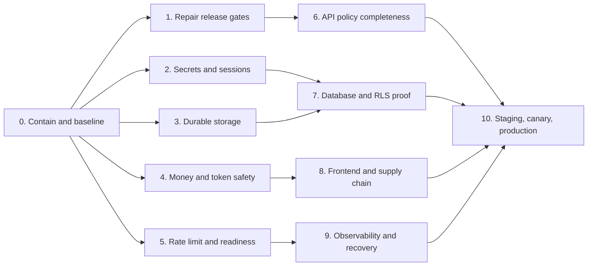

# Beverly Production Hardening Implementation Plan

**Plan date:** 2026-07-26  
**Source baseline:** `fe1d35920ebaebb0082221bdfe8cc7016331985e`  
**Inputs:** production-stack audit and confirmation audit dated 2026-07-26  
**Primary outcome:** safely enable production financial writes only after every mandatory gate passes for one immutable release SHA.

## 1. Non-negotiable release rule

The following production flags remain disabled until Phase 10 approval:

- `MONEY_WRITES_ENABLED=false`
- `WALLET_PROXY_MONEY_WRITES_ENABLED=false`
- `ALLOW_LIVE_WRITES=false`
- any equivalent runtime live-write flag remains disabled

No schedule, stakeholder request, or partial test result overrides this rule. A failed mandatory check returns the release to the owning phase.

## 2. Delivery model

### Required roles

| Role | Accountable for |
|---|---|
| Executive sponsor | Risk acceptance and business go/no-go |
| Release manager | Plan tracking, immutable SHA, deployment gates and rollback |
| Backend lead | API, storage, rate limit, readiness and provider behavior |
| Wallet/finance lead | Ledger, holds, payments, token issuance and reconciliation |
| Database lead | Migrations, RLS, backup, restore and retention |
| Security lead | Secrets, auth, threat tests, CSP and approval |
| Frontend lead | Browser regressions, token handling and bundles |
| Platform/SRE lead | Vercel, monitoring, alerts, capacity and recovery |
| QA lead | Test evidence, traceability and sign-off |

One person may hold multiple roles, but the author of a money/auth/migration change cannot be its only approver.

### Status definitions

- **Not started:** no approved work or evidence.
- **In progress:** owner and target date assigned; implementation underway.
- **Blocked:** blocker, owner and unblock action recorded.
- **Ready for verification:** code complete; required checks awaiting independent run.
- **Complete:** acceptance evidence linked to the exact commit SHA.

### Evidence required for every task

- pull request and reviewed diff;
- exact commit SHA;
- automated test name and result;
- environment used;
- configuration change record, if applicable;
- rollback instruction;
- named approver and completion timestamp.

## 3. Phase dependency map

Phases 1–5 may run in parallel after Phase 0. Phase 10 cannot start until Phases 1–9 are complete.

## 4. Endpoint goals

### System endpoints

| Endpoint | Goal | Mandatory completion check |
|---|---|---|
| `GET /api/wallet-service/health` | Liveness only; no optional dependency failure | Returns `200` while the process can serve requests; no secrets or internal stack details |
| `GET /api/wallet-service/ready` | Reflect required dependencies for active deployment mode | Returns `200` in production; returns `503` when database or another required dependency fails; disabled optional queues are reported separately |
| `GET /api/wallet-service/version` | Identify exact deployment | SHA exactly matches approved release SHA; version response is immutable per deployment |

### Identity and access endpoints

| Endpoint | Goal | Mandatory completion check |
|---|---|---|
| `GET /api/v1/admin/me` | Reject unauthenticated and expired sessions | `401` without/with invalid token; correct staff identity and station scope with valid token |
| `POST /api/v1/customer/auth/email/login` | Protected authentication | Account/IP rate limits, generic error response, session policy and audit event verified |
| `POST /api/v1/customer/auth/login` | Protected OTP/login flow | Distributed throttling, replay prevention and expiry tests pass |
| `POST /api/v1/admin/access/users/:userId/revoke-sessions` | Immediate revocation | Old sessions rejected across instances after successful revocation |
| `PATCH /api/v1/admin/access/users/:userId/station` | Reachable and authorized | Canonical mutation policy exists; unauthorized role denied; allowed admin succeeds and is audited |
| `PATCH /api/v1/admin/vendors/:id/station` | Reachable and station-safe | Canonical policy exists; cross-station request denied; authorized update is audited |

### Financial endpoints

| Endpoint | Goal | Mandatory completion check |
|---|---|---|
| `POST /api/v1/customer/wallet/fund` | Idempotent funding initialization | Duplicate client request cannot create duplicate payable transaction |
| `POST /api/v1/vendor/funding/paystack` | Idempotent vendor funding | Actor, amount, currency and reference validated server-side |
| `POST /api/v1/vendor/funding/bank-transfer` | Controlled funding request | Permission, evidence, duplicate and status-transition checks pass |
| `POST /api/v1/webhook/paystack` | Authentic, replay-safe fulfillment | Invalid signature rejected; duplicate event is idempotent; response timing and retry behavior verified |
| `POST /api/v1/customer/purchase/preview` | Server-authoritative quote | Meter, tariff, fees, VAT, balance and quote expiry validated server-side |
| `POST /api/v1/customer/purchase` | Exactly-once financial outcome | Hold, ledger, token, receipt and audit reconcile; ambiguous provider result never releases funds |
| `POST /api/v1/customer/purchase/step-up-verify` | High-risk confirmation | One-time/expiring challenge; attempt limit; replay denied |
| `POST /api/v1/customer/purchase/:purchaseOrderId/remote-send` | Safe retry/delivery | Cannot issue a second token; status transition and idempotency enforced |
| `POST /api/v1/vendor/vend/:purchaseOrderId/remote-send` | Safe vendor delivery | Vendor ownership, station scope and duplicate protection verified |
| `POST /api/v1/admin/funding/:id/approve` | Authorized approval | Separation of duties, transition lock and audit evidence |
| `POST /api/v1/admin/funding/:id/reject` | Authorized rejection | Cannot reject settled/fulfilled funding; reason required and audited |
| `POST /api/v1/admin/funding/reconcile-approved` | Controlled repair | Dry-run output, bounded batch and repeat-safe reconciliation |
| `PATCH /api/v1/admin/wallets/:id/status` | Controlled wallet state | Permission, reason, concurrent update and audit tests pass |
| `PATCH /api/v1/admin/wallets/:id/limits` | Controlled limit change | Bounds, permission, step-up and audit tests pass |
| `POST /api/v1/admin/refunds` | Safe refund initiation | Original transaction, remaining refundable amount and idempotency verified |
| `POST /api/v1/admin/refunds/:id/approve` | Safe refund approval | Separation of duties and atomic ledger posting verified |
| `POST /api/v1/admin/refunds/:id/reject` | Valid state transition | Authorized rejection with immutable reason/audit |

### VAT policy endpoints currently blocked by missing route policy

| Endpoint | Goal | Mandatory completion check |
|---|---|---|
| `POST /api/v1/admin/vat-policies` | Reachable only to VAT administrators | Canonical policy added; schema/range/effective-date validation and audit pass |
| `POST /api/v1/admin/vat-policies/:id/approve` | Controlled four-eyes approval | Creator cannot self-approve unless formally accepted; overlapping policy prevented |

## 5. Phase 0 — Containment and immutable baseline

**Goal:** prevent new financial/data-loss exposure and establish one auditable starting point.  
**Owner:** release manager.  
**Duration target:** same day.  
**Depends on:** none.

### Tasks

- [ ] Confirm all financial/live-write flags are disabled in Production and Preview.
- [ ] Freeze `20260725100000_database_quota_resolution.sql` and manual cleanup execution.
- [ ] Record current production SHA from `/api/wallet-service/version`.
- [ ] Record Vercel project/environment IDs and Supabase project ID without copying secrets into tickets.
- [ ] Export a redacted environment-variable name inventory for Development, Preview and Production.
- [ ] Record current migration history, database size, largest tables and backup/PITR status.
- [ ] Open one release tracker containing every checkbox in this plan.
- [ ] Assign accountable owner and reviewer to each phase.
- [ ] Define rollback commander and business incident contact.

### Completion gate

- [ ] Written evidence shows financial writes are disabled.
- [ ] No destructive migration or cleanup job is scheduled to run during remediation.
- [ ] Production SHA and infrastructure identifiers are recorded.
- [ ] Every subsequent phase has an owner, reviewer and target date.

### Rollback

This phase changes no application behavior except disabling risky flags or schedules. Restore a schedule only after Phase 7 approval.

## 6. Phase 1 — Repair the release test gates

**Goal:** make the repository's release signal truthful before relying on it.  
**Owner:** QA lead with frontend/backend owners.  
**Duration target:** 1–2 days.  
**Depends on:** Phase 0.

### Tasks

- [ ] Reproduce all failures on Node 22 from a clean dependency install.
- [ ] Fix `tests/station-alerts.browser.test.cjs` so the `GW-KYA` alert flow passes for the correct product behavior.
- [ ] Fix the full CRM browser login/dashboard smoke failure.
- [ ] Reconcile the wallet sidebar account-footer implementation with its contract.
- [ ] Replace the three OEM Hub raw buttons with the existing design-system button primitive.
- [ ] Run `npm run test:full-smoke` successfully on Node 22.
- [ ] Remove `continue-on-error` from release-critical browser/E2E jobs.
- [ ] Add the exact route-policy coverage test described in Phase 6.
- [ ] Require the full-smoke job in branch protection.

### Completion gate

- [ ] Clean Node 22 run: build passed.
- [ ] Clean Node 22 run: unit/contract tests passed.
- [ ] Clean Node 22 run: browser tests passed.
- [ ] Clean Node 22 run: wallet tests passed.
- [ ] Clean Node 22 run: visual audit passed.
- [ ] GitHub required checks enforce the same commands.

### Rollback

Revert only the failing UI/test change as one reviewed commit. Do not weaken selectors or assertions merely to make a wrong behavior pass.

## 7. Phase 2 — Secrets, sessions and authentication

**Goal:** configuration failure must stop deployment, never select a known secret or weaker session mode.  
**Owner:** security lead + backend lead.  
**Duration target:** 1–2 days.  
**Depends on:** Phase 0.

### Tasks

- [ ] Remove `beverly-default-session-signing-secret-2026` from runtime fallback behavior.
- [ ] Require a dedicated `SESSION_SECRET` of at least 32 random bytes at cold start.
- [ ] Do not reuse `JWT_SECRET`, `SUPABASE_JWT_SECRET` or `APP_ENCRYPTION_KEY` as the session secret.
- [ ] Make `security:review:production` a mandatory deployment check.
- [ ] Enforce minimum length/format for `APP_ENCRYPTION_KEY` and other production secrets.
- [ ] Restrict production CORS to approved HTTPS origins.
- [ ] Rotate the session secret and invalidate existing Beverly sessions.
- [ ] Verify idle timeout, absolute timeout, refresh, logout and admin revocation across two instances.
- [ ] Add negative tests for missing, short, default and reused secrets.
- [ ] Confirm error/log output never contains tokens, OTP values or secrets.

### Completion gate

- [ ] Application startup fails when `SESSION_SECRET` is absent/weak.
- [ ] A session signed with the removed fallback is rejected.
- [ ] Revocation is effective across instances.
- [ ] Authentication endpoints return generic errors and distributed rate headers.
- [ ] Security lead signs the secret rotation record.

### Rollback

Rollback uses the previous application binary only while keeping the new secret. Do not restore the public fallback. If login breaks, keep writes disabled and issue new sessions after correcting configuration.

## 8. Phase 3 — Durable storage and fail-closed persistence

**Goal:** production writes either persist durably once or fail visibly.  
**Owner:** backend lead + database lead.  
**Duration target:** 2–3 days.  
**Depends on:** Phase 0.

### Tasks

- [ ] Change the shared storage adapter so production mutation failure never invokes a local action.
- [ ] Reject local/memory/SQLite session-store modes at production startup.
- [ ] Keep local fallback only under explicit development/test mode.
- [ ] Decide whether read fallback is needed; if retained, label responses stale and set a bounded TTL.
- [ ] Ensure API cache writes set `expires_at` and reads reject expired rows.
- [ ] Make mandatory audit-write failure observable and return failure for security-critical mutations where appropriate.
- [ ] Add one integration test that forces Supabase `500`, expects `503`, and confirms no local write.
- [ ] Test concurrent instances against the same durable record.
- [ ] Verify OEM credential encryption/decryption only uses the approved key.

### Completion gate

- [ ] No production code path acknowledges a local fallback mutation.
- [ ] Supabase outage produces controlled `503`, correlation ID and alert.
- [ ] Cache expiry tests pass.
- [ ] Multi-instance persistence test passes.
- [ ] Database and security reviewers approve.

### Rollback

Rollback may return the service to read-only mode. It must not restore silent local writes.

## 9. Phase 4 — Financial and token-provider correctness

**Goal:** every purchase has exactly one explainable financial outcome, including network ambiguity.  
**Owner:** wallet/finance lead.  
**Duration target:** 3–5 days.  
**Depends on:** Phase 0; integrates with Phase 3.

### State model required

Use the existing purchase model where possible. Add only the minimum state necessary to distinguish:

- definite pre-dispatch failure;
- dispatched and outcome unknown;
- token received but persistence/delivery pending review;
- delivered;
- safely reversed after reconciliation proves no token exists.

### Tasks

- [ ] Add an `AbortController` deadline to every energy-provider request.
- [ ] Set the provider deadline below the Vercel function deadline and document the values.
- [ ] Mark timeout/disconnect after dispatch as outcome unknown; do not release the hold.
- [ ] Reconcile unknown outcomes using immutable purchase reference before retry/reversal.
- [ ] Prove or enforce provider idempotency for duplicate references.
- [ ] Prevent remote-send endpoints from issuing a second token.
- [ ] Keep ledger/hold/order updates atomic through existing RPC/locking patterns.
- [ ] Verify payment amount, currency, customer/vendor and reference server-side.
- [ ] Require idempotency keys on funding, purchase, refund and approval actions where absent.
- [ ] Add alert/queue handling for unknown outcomes and holds approaching expiry.
- [ ] Add an operator action that reconciles rather than manually guessing the result.

### Mandatory tests

- [ ] Provider rejects before accepting request: hold safely released.
- [ ] Provider accepts then connection drops: hold retained; status outcome unknown.
- [ ] Provider response exceeds deadline: no duplicate token on retry.
- [ ] Duplicate purchase request: one order, one ledger effect, one token.
- [ ] Token received but database write fails: pending review, hold retained.
- [ ] Delayed webhook and duplicate webhook: exactly one fulfillment.
- [ ] Concurrent workers claim one payment through `fn_claim_payment_fulfillment`.
- [ ] Amount/currency/reference mismatch: fulfillment blocked and review alerted.
- [ ] Reconciliation proves no token: controlled reversal posts once.

### Completion gate

- [ ] Finance lead can map every error branch to a balance, hold, order and token state.
- [ ] Sum of ledger postings remains balanced in all fault-injection tests.
- [ ] No ambiguous outcome releases value automatically.
- [ ] Vendor idempotency behavior is documented and tested.
- [ ] Security and finance reviewers sign off.

### Rollback

Keep new unknown outcomes held. If provider integration is rolled back, disable purchases and reconcile all in-flight references before any release.

## 10. Phase 5 — Distributed rate limiting, proxy integrity and readiness

**Goal:** public behavior remains consistent across serverless instances and deployment modes.  
**Owner:** platform/SRE + backend lead.  
**Duration target:** 2–4 days.  
**Depends on:** Phase 0.

### Tasks

- [ ] Use one managed distributed rate-limit store independent of optional queues.
- [ ] Derive client IP only from platform-trusted forwarding headers.
- [ ] Prefer authenticated actor/account keys for sensitive authenticated actions.
- [ ] Define separate policies for login, OTP, funding, purchase, webhook, admin mutation and general reads.
- [ ] Apply limits before expensive auth/provider/database work where safe.
- [ ] Preserve backend `429`, `Retry-After`, `RateLimit-*` and correlation headers through `api/reference.js`.
- [ ] Ensure canonical wallet routes do not bypass the public limiter.
- [ ] Correct readiness to check only dependencies required for the active mode.
- [ ] Expose optional queue capability separately without returning secret connection details.
- [ ] Fail startup if production accidentally selects a development Redis/queue stub.

### Completion gate

- [ ] Two-instance test shares one counter and blocks at the configured threshold.
- [ ] Public canonical endpoint returns consistent rate headers.
- [ ] Proxy preserves `429` and `Retry-After` unchanged.
- [ ] `/ready` returns `200` in valid production serverless mode.
- [ ] Database failure makes `/ready` return `503` within the timeout.
- [ ] Rate-store outage follows an explicitly approved fail-open/fail-closed rule per endpoint class.

### Rollback

If the distributed limiter is unstable, fail closed for login/OTP/money/admin mutations and temporarily fail open only for low-risk reads with an active incident and tight platform firewall limits.

## 11. Phase 6 — API policy and authorization completeness

**Goal:** every mutation has exactly one explicit policy and every policy maps to a real route.  
**Owner:** backend lead + security reviewer.  
**Duration target:** 1–2 days.  
**Depends on:** Phases 0 and 1.

### Tasks

- [ ] Add canonical route policies for the four missing admin mutations.
- [ ] Generate the mutation route set from Fastify registration in a test.
- [ ] Assert every `POST`, `PUT`, `PATCH`, and `DELETE` under `/api/v1` resolves to exactly one policy.
- [ ] Assert every non-wildcard policy resolves to a registered route.
- [ ] Assert wildcard policies cover only their intended development routes.
- [ ] Test anonymous, wrong-role, wrong-station and correct-role access for each critical mutation.
- [ ] Verify all money mutations are marked as money-sensitive in policy metadata.
- [ ] Require reason/step-up/separation-of-duties where the endpoint matrix specifies it.
- [ ] Correct webhook audit-tap exclusion from `/webhooks/` to the actual `/webhook/` prefix.

### Completion gate

- [ ] Route-policy test reports 100% exact coverage, not minimum counts.
- [ ] The four formerly dead endpoints are reachable only by authorized users.
- [ ] Cross-station and cross-tenant tests deny access.
- [ ] Every successful/failed sensitive mutation has one coherent audit trail.

### Rollback

Revert the affected endpoint to unavailable rather than bypassing the global fail-closed hook.

## 12. Phase 7 — Migration chain, RLS, retention and recovery proof

**Goal:** reproduce the database safely from zero and prove isolation and recoverability.  
**Owner:** database lead + security lead.  
**Duration target:** 3–7 days.  
**Depends on:** Phases 2 and 3.

### Migration tasks

- [ ] Inventory all tracked migrations in order and compare with production migration history.
- [ ] Remove or quarantine foreign ERP table operations from `20260708_vapt_security_remediation.sql`.
- [ ] Create an empty temporary database from the complete retained migration chain.
- [ ] Run schema diff between clean build, expected schema and production.
- [ ] Make migration-from-zero a CI check.
- [ ] Verify every function's owner, `search_path`, grants and execution role.

### RLS tasks

- [ ] Enumerate every table/view with RLS enabled/disabled and every policy.
- [ ] Test `anon`, customer, vendor, staff roles, station-scoped staff and service role.
- [ ] Test select/insert/update/delete separately.
- [ ] Test horizontal ID substitution and cross-station access.
- [ ] Confirm sensitive tables deny anonymous access.
- [ ] Restrict service-role use to server-only modules and never browser bundles.

### Destructive migration tasks

- [ ] Split one-time quota remediation from recurring retention policy.
- [ ] Produce dry-run row/byte counts for JSON rewrite and each delete.
- [ ] Confirm legal/business retention requirements.
- [ ] Verify timestamped backup/PITR immediately before execution.
- [ ] Execute bounded batches with lock/statement timeout and abort thresholds.
- [ ] Monitor database size, locks, latency, replica lag and error rate.
- [ ] Record post-run counts and verify application/reconciliation invariants.

### Recovery tasks

- [ ] Define approved RPO and RTO for database, auth and application configuration.
- [ ] Restore production backup into an isolated project.
- [ ] Apply pending safe migrations there.
- [ ] Run ledger balance, payment, purchase, token and RLS checks.
- [ ] Record actual recovery duration and data gap.

### Completion gate

- [ ] Clean migration succeeds from zero.
- [ ] Schema diff has no unexplained drift.
- [ ] All role/RLS isolation tests pass.
- [ ] Restore drill meets RPO/RTO.
- [ ] Data owner and database/security leads approve retention execution.

### Rollback

For schema changes, use a forward corrective migration. For destructive data work, stop batches and restore to a new isolated database; never use an unverified reverse script on the only production copy.

## 13. Phase 8 — Frontend, CSP, uploads and dependency safety

**Goal:** remove avoidable browser attack paths and restore frontend release quality.  
**Owner:** frontend lead + security lead.  
**Duration target:** 3–5 days.  
**Depends on:** Phases 1 and 4.

### Tasks

- [ ] Remove CSP `unsafe-eval`.
- [ ] Replace inline scripts/styles with nonce/hash-compatible assets and remove `unsafe-inline` where feasible.
- [ ] Inventory all token storage/read paths; move application session material to secure `HttpOnly`, `Secure`, `SameSite` cookies where architecture permits.
- [ ] Audit HTML/render sinks and prohibit unsafe dynamic HTML.
- [ ] Make profile-image validation fail closed.
- [ ] Validate magic bytes and decode/re-encode supported image formats server-side.
- [ ] Enforce size, dimensions and output content type before public storage activation.
- [ ] Patch PostCSS to a non-vulnerable version.
- [ ] Isolate or replace the ExcelJS/archive path if it accepts untrusted workbooks.
- [ ] Give every temporary dependency-risk exception an owner, containment and expiry date.
- [ ] Correct mixed static/dynamic import of `src/services/api.js`.
- [ ] Establish measured bundle budgets for CRM JS/CSS and ECharts.

### Completion gate

- [ ] CSP test passes without `unsafe-eval`; any temporary `unsafe-inline` has a tracked removal owner/date.
- [ ] Upload test rejects spoofed MIME, malformed image and scanner/decoder failure.
- [ ] No high advisory remains without signed, time-bounded risk treatment.
- [ ] Browser and visual suites pass.
- [ ] Bundle budgets are enforced in CI.

### Rollback

If stricter CSP breaks a feature, keep the feature disabled or add the narrowest nonce/hash. Do not restore global `unsafe-eval`.

## 14. Phase 9 — Observability, alerting, availability and operations

**Goal:** detect, diagnose and recover from production failures before enabling money writes.  
**Owner:** platform/SRE lead.  
**Duration target:** 3–5 days.  
**Depends on:** Phase 5; coordinates with Phase 7.

### Required telemetry

- request count, status and latency by route class;
- readiness and dependency state;
- authentication failure and rate-limit events;
- payment/webhook success, duplicate, mismatch and retry counts;
- purchase/token states, including outcome unknown and pending review;
- stuck/expiring holds;
- ledger imbalance/reconciliation exceptions;
- Supabase persistence and audit-write failures;
- scheduled-job success/failure/duration;
- deployment SHA and environment on every event.

### Tasks

- [ ] Send structured logs to an external retained sink.
- [ ] Remove/redact credentials, tokens, OTPs, personal data and provider payload secrets.
- [ ] Ensure correlation ID follows public proxy, backend, database job and provider call.
- [ ] Configure error tracking with release SHA and source maps protected from public disclosure.
- [ ] Create dashboards for availability, financial invariants, auth abuse and data persistence.
- [ ] Schedule public health/readiness probes from more than one region.
- [ ] Alert on readiness failure, error-rate/latency thresholds, persistence failure, unknown token outcomes, webhook backlog and ledger mismatch.
- [ ] Add runbooks with named on-call owner, decision tree and safe commands.
- [ ] Make “zero log files/events reviewed” fail as no evidence.
- [ ] Run one tabletop incident and one restore/reconciliation drill.

### Completion gate

- [ ] A synthetic test event appears end to end in logs, metrics, error tracking and alert channel.
- [ ] On-call acknowledges a test alert within target time.
- [ ] Dashboard shows exact production SHA.
- [ ] Runbooks successfully guide the tabletop and restore drill.
- [ ] No sensitive data appears in sampled telemetry.

### Rollback

If telemetry is unavailable, financial writes remain disabled. Logging failures must not expose secrets or crash read-only traffic, but mandatory financial/audit persistence failures must alert and fail according to policy.

## 15. Phase 10 — Staging, canary and production release

**Goal:** enable writes gradually for one verified SHA with immediate rollback capability.  
**Owner:** release manager.  
**Duration target:** minimum one full staging cycle plus agreed production soak.  
**Depends on:** all prior phases complete.

### Stage A — Candidate lock

- [ ] Select one candidate SHA; no unreviewed commits after selection.
- [ ] Verify two approvals for auth, money and migration changes.
- [ ] Verify all required CI checks passed on Node 22.
- [ ] Generate artifact/SBOM/dependency evidence for the SHA.
- [ ] Confirm rollback artifact and configuration are available.

### Stage B — Production-equivalent staging

- [ ] Deploy with production-equivalent managed services and separate data/secrets.
- [ ] Confirm `/version` equals candidate SHA.
- [ ] Hold `/ready=200` for at least 30 minutes.
- [ ] Run the endpoint matrix: auth denial, permissions, RLS, rates and headers.
- [ ] Run Paystack valid/invalid/duplicate webhook scenarios.
- [ ] Run provider accepted-then-disconnected scenario.
- [ ] Run one complete funding, purchase, token, receipt and reconciliation flow.
- [ ] Run backup/restore smoke against staging data.
- [ ] Obtain QA, security, database and finance sign-off.

### Stage C — Production deploy with writes disabled

- [ ] Deploy the exact candidate SHA.
- [ ] Confirm `/version`, `/health`, `/ready`, CSP and rate headers.
- [ ] Confirm external logs/metrics/alerts receive production events.
- [ ] Observe read/auth traffic for the agreed 30–60 minute stability period.
- [ ] Confirm no migration drift and no unexpected cleanup job.

### Stage D — Internal canary writes

- [ ] Enable writes only for approved internal canary identities/station.
- [ ] Execute one minimum-value approved funding/purchase.
- [ ] Reconcile payment amount, wallet balance, hold, ledger entries, purchase order, token, receipt and audit log.
- [ ] Verify duplicate submission produces no duplicate value/token.
- [ ] Verify rollback/disable switch works without redeploy.
- [ ] Soak for the approved period with zero critical alerts.

### Stage E — Gradual rollout

- [ ] Expand to 5% of eligible traffic/stations.
- [ ] Hold and review error, latency, unknown outcome, mismatch and ledger metrics.
- [ ] Expand to 25%, then 50%, then 100% only after explicit approval at each gate.
- [ ] Keep an incident commander available throughout rollout.

### Automatic abort conditions

Immediately disable writes if any occurs:

- `/ready` is non-200 for two consecutive probes;
- any ledger imbalance or duplicate financial posting;
- any duplicate token for one purchase reference;
- unknown outcomes exceed the approved count/age threshold;
- persistence falls back locally or mandatory audit persistence fails;
- payment/reference/currency mismatch is fulfilled;
- elevated `5xx`, provider timeout or latency crosses the approved threshold;
- deployed SHA differs from the approved candidate;
- monitoring/alerting becomes unavailable.

### Final completion gate

- [ ] All Phases 0–9 marked complete with evidence.
- [ ] Exact production SHA passed every mandatory check.
- [ ] Internal canary reconciled exactly.
- [ ] Gradual rollout completed without abort condition.
- [ ] Business sponsor, release manager, security, finance, database and SRE signed go-live.
- [ ] Post-release review date and owners scheduled.

## 16. Master task completion list

### Release safety

- [ ] Writes disabled during remediation.
- [ ] Immutable candidate SHA selected.
- [ ] Rollback artifact and feature kill switch tested.
- [ ] Required independent reviews configured.
- [ ] Full release suite blocking and green on Node 22.

### Auth and API security

- [ ] No fallback/default production secret.
- [ ] Sessions rotated and revocation works across instances.
- [ ] CORS and CSP hardened.
- [ ] Every mutation has one exact route policy.
- [ ] Tenant/station/role negative tests pass.

### Money correctness

- [ ] Distributed limits protect financial/auth endpoints.
- [ ] Payment/webhook idempotency verified.
- [ ] Provider deadlines implemented.
- [ ] Ambiguous token outcome retains hold and reconciles by reference.
- [ ] Funding, purchase, refund and approval concurrency tests pass.
- [ ] Ledger remains balanced under fault injection.

### Data and recovery

- [ ] Production mutations cannot use local fallback.
- [ ] Clean migration from zero passes.
- [ ] Foreign ERP migration removed/quarantined.
- [ ] Full RLS role matrix passes.
- [ ] Destructive retention approved and safely staged.
- [ ] Restore drill meets RPO/RTO.

### Platform and operations

- [ ] Health, readiness and version semantics verified.
- [ ] Rate/correlation headers preserved through proxy.
- [ ] External logs, metrics, errors and alerts operational.
- [ ] Public synthetic monitoring scheduled.
- [ ] Runbooks and on-call escalation tested.
- [ ] Capacity/quota thresholds documented.

### Frontend and dependencies

- [ ] All browser/wallet/visual regressions fixed.
- [ ] Uploads validate real image content and fail closed.
- [ ] PostCSS patched.
- [ ] Remaining dependency risks owned and time-bounded.
- [ ] Bundle budgets enforced.

### Go-live

- [ ] Production SHA matches approval.
- [ ] Read-only soak passes.
- [ ] Canary transaction reconciles exactly.
- [ ] Duplicate canary is idempotent.
- [ ] Gradual rollout gates approved.
- [ ] No automatic abort condition active.
- [ ] Final cross-functional sign-off recorded.

## 17. Definition of done

The implementation is complete only when:

1. every mandatory checkbox is backed by evidence for the exact production SHA;
2. all financial state transitions are deterministic or explicitly held as unknown pending reconciliation;
3. every production mutation is durable, authorized, rate-limited and audited;
4. the database can be rebuilt and restored within approved objectives;
5. production failures are externally visible and actionable;
6. the canary transaction and duplicate test reconcile exactly;
7. all accountable owners sign the final go-live record.

Passing unit tests alone, deploying successfully, or receiving `200` from `/health` does not satisfy this definition.
