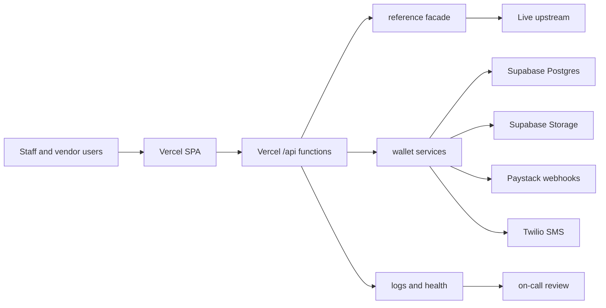
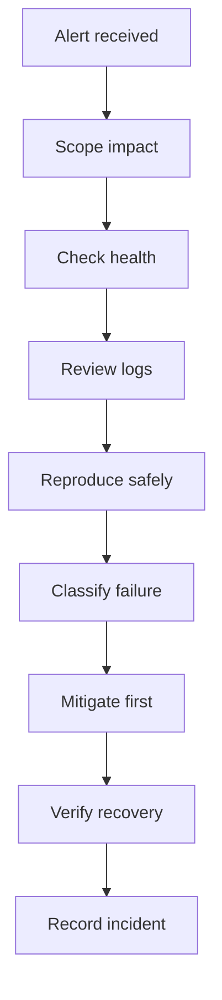
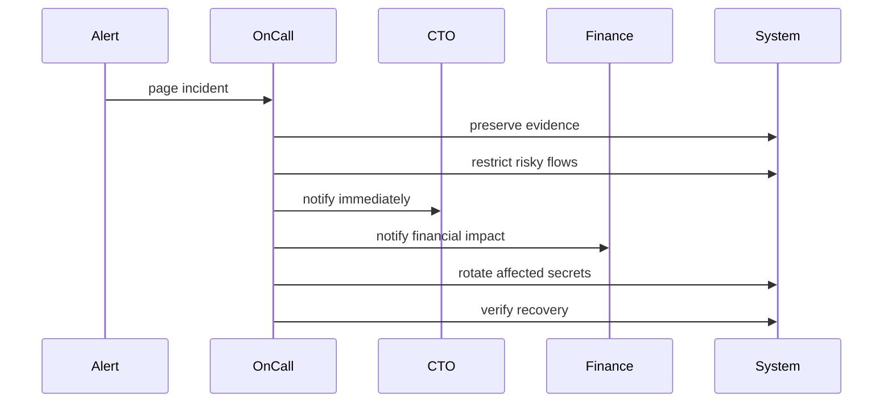

# Runbook: Operational Readiness

**Severity:** P0 to P3
**Owner:** Engineering on-call
**Scope:** Scalability, debugging, security

---

## Architecture Fit

- `ARCHITECTURE.md` is canonical.
- This file adds runbook guidance.
- No runtime layer changes.
- No API contract changes.
- No architecture update required.

## Dependency Map



## Scalability Plan

### Scale Objectives

- Keep reads responsive.
- Keep writes idempotent.
- Keep ledgers append-only.
- Keep proof files private.
- Keep live writes gated.
- Keep fallbacks visible.

### Capacity Tiers

| Tier | Trigger | Action | Validation |
| --- | --- | --- | --- |
| Preview | every release | run smoke gates | `npm run smoke:vercel` |
| Low traffic | normal operations | cache live reads | `/api/system/live-report` |
| High traffic | slow route reads | reduce fan-out | route matrix capture |
| Payment surge | vend backlog grows | prioritize holds | purchase monitor |
| Incident load | repeated failures | freeze risky flows | incident runbook |

### Bottleneck Controls

- Live reads use opt-in mode.
- Live writes need approval.
- Wallet balances derive safely.
- Holds protect purchase funds.
- Rate limits protect APIs.
- CORS restricts origins.
- Upload policy restricts files.
- Cron refresh warms data.
- Smoke tests guard deploys.

### Scaling Checklist

- [ ] Confirm target URL.
- [ ] Run production env check.
- [ ] Run live report.
- [ ] Run route matrix.
- [ ] Review fallback counts.
- [ ] Review rate-limit logs.
- [ ] Review wallet holds.
- [ ] Review vend backlog.
- [ ] Review storage usage.
- [ ] Review Supabase pool.
- [ ] Run preview smoke.
- [ ] Run guarded write smoke.
- [ ] Record release decision.

### Scale Guardrails

- Do not disable write guards.
- Do not bypass idempotency.
- Do not expose proof files.
- Do not hardcode upstream URLs.
- Do not add Vuex state.
- Do not add raw colors.
- Do not route retired pages.
- Do not weaken RLS.

## Debugging Workflows

### Triage Loop



### First Checks

1. Check `/api/system/health`.
2. Check `/api/system/live-report`.
3. Check latest deployment.
4. Check Vercel function logs.
5. Check Supabase status.
6. Check upstream auth status.
7. Check recent writes.
8. Check rate-limit events.

### Failure Matrix

| Symptom | Likely area | First command |
| --- | --- | --- |
| Login fails | auth config | `npm run security:check` |
| Dashboard empty | live reads | `npm run live:report` |
| Tables mismatch | route contract | `npm run route-matrix:capture` |
| Writes rejected | write guard | `npm run write:staging` |
| Wallet balance wrong | ledger service | `npm run test:wallet` |
| MFA fails | auth runtime | `npm run test:mfa` |
| Upload fails | upload policy | `npm run test:security` |
| Preview broken | deployment | `npm run smoke:vercel` |

### Debugging Rules

- Preserve failing payloads.
- Redact all secrets.
- Reproduce in preview first.
- Prefer read-only probes.
- Check contract tests early.
- Capture exact timestamps.
- Capture request IDs.
- Capture actor IDs.
- Avoid data mutation.
- Escalate financial drift.

### Evidence Checklist

- [ ] User impact.
- [ ] Start time.
- [ ] End time.
- [ ] Affected route.
- [ ] Affected role.
- [ ] Request ID.
- [ ] Deployment ID.
- [ ] Environment mode.
- [ ] Write guard state.
- [ ] Live read mode.
- [ ] Relevant logs.
- [ ] Recovery action.

## Security Protocols

### Security Objectives

- Keep secrets external.
- Keep RLS enforced.
- Keep sessions scoped.
- Keep MFA enforced.
- Keep writes audited.
- Keep uploads private.
- Keep incidents preserved.

### Access Protocol

- Staff uses Supabase Auth.
- Vendors use vendor roles.
- Finance uses checker role.
- Dev console needs permission.
- Service role stays backend-only.
- Same actor cannot approve.
- Frozen wallets cannot transact.

### Secret Protocol

- Store secrets in Vercel.
- Store local values in `.env`.
- Commit only `.env.example`.
- Rotate after exposure.
- Rotate after staff exit.
- Rotate before production launch.
- Run smoke after rotation.
- Record rotation date.

### Write Protocol

- Default writes disabled.
- Enable only by approval.
- Require idempotency keys.
- Audit every wallet write.
- Hold before vend dispatch.
- Capture after success.
- Release after failure.
- Review unknown delivery.

### Incident Protocol



### Security Checklist

- [ ] `ALLOW_LIVE_WRITES=false`.
- [ ] CORS origins restricted.
- [ ] Rate limits enabled.
- [ ] RLS policies enabled.
- [ ] MFA flows tested.
- [ ] Upload rules reviewed.
- [ ] Secrets absent from git.
- [ ] Service role hidden.
- [ ] Audit events queryable.
- [ ] Security events queryable.
- [ ] Incident runbook linked.
- [ ] Key rotation tested.

## Operating Cadence

| Cadence | Action |
| --- | --- |
| Every deploy | smoke preview |
| Daily rollout | live report |
| Weekly | security check |
| Monthly | key review |
| Quarterly | incident drill |
| Before launch | full smoke |

## Required Gates

```powershell
npm run security:check
npm run live:report
npm run route-matrix:capture
npm run test:security
npm run test:wallet
npm run build
```

## Review Questions

- Traffic tier: High traffic.
- Critical flows: All.
- Human paging: Recommended alerts.
- Drill roles: All.

## Implementation Task List

### End State

- High traffic is supported.
- All critical flows are covered.
- Recommended alerts page humans.
- All roles complete drills.
- Endpoint checks run end-to-end.
- Payment history stays auditable.
- Duplicate charges stay blocked.
- Webhooks stay signed.
- Ledger rows stay immutable.

### Phase 1: Baseline Inventory

- [ ] Confirm production URL.
  - Endpoint goal: `GET /api/system/health` returns `200`.
  - Endpoint goal: `GET /api/system/live-report` returns route counts.
  - Owner: Engineering on-call.
  - Consumer: Release owner.

- [ ] Confirm wallet API reachability.
  - Endpoint goal: `GET /health` returns `ok`.
  - Endpoint goal: `GET /ready` confirms dependencies.
  - Owner: Engineering on-call.
  - Consumer: Wallet operations.

- [ ] Confirm route coverage.
  - Endpoint goal: `npm run route-matrix:capture` completes.
  - Endpoint goal: all active routes classify correctly.
  - Owner: Engineering on-call.
  - Consumer: QA lead.

### Phase 2: High Traffic Read Path

- [ ] Validate dashboard reads.
  - Endpoint goal: dashboard data loads.
  - Endpoint goal: no fallback facade usage.
  - Command: `npm run live:report`.
  - Alert: visible fallback usage.

- [ ] Validate table reads.
  - Endpoint goal: key tables return data.
  - Endpoint goal: schema drift stays zero.
  - Command: `npm run route-matrix:capture`.
  - Alert: schema drift repeats.

- [ ] Validate analytics reads.
  - Endpoint goal: station consumption loads.
  - Endpoint goal: EIH fan-out stays bounded.
  - Command: `npm run consumption:verify`.
  - Alert: mixed route count.

### Phase 3: Money Write Safety

- [ ] Confirm global write guard.
  - Endpoint goal: guarded writes return blocked.
  - Endpoint goal: preview never charges.
  - Command: `npm run write:staging`.
  - Alert: write guard disabled.

- [ ] Confirm idempotency enforcement.
  - Endpoint goal: duplicate vend returns cached result.
  - Endpoint goal: duplicate funding returns cached result.
  - Endpoint goal: duplicate meter order returns cached result.
  - Tests: `npm run test:wallet`.

- [ ] Confirm ledger immutability.
  - Endpoint goal: every status change appends.
  - Endpoint goal: no status row overwrite.
  - Endpoint goal: corrections use compensating entries.
  - Tests: `npm run test:wallet`.

### Phase 4: Paystack Webhook Safety

- [ ] Validate signed webhook ingest.
  - Endpoint goal: `POST /api/v1/webhook/paystack` rejects bad signatures.
  - Endpoint goal: valid events persist first.
  - Endpoint goal: duplicate event IDs return duplicate.
  - Tests: backend Paystack tests.

- [ ] Validate webhook reconciliation.
  - Endpoint goal: `charge.success` verifies server-side.
  - Endpoint goal: success fulfills once.
  - Endpoint goal: failed processing remains retryable.
  - Tests: payment webhook tests.

- [ ] Validate payment sweeper.
  - Endpoint goal: stale payments reconcile.
  - Endpoint goal: stuck transactions surface.
  - Command: wallet worker payments job.
  - Alert: webhook lag exceeds threshold.

### Phase 5: Critical Flow Coverage

- [ ] Vendor flow.
  - Endpoint goal: `GET /api/v1/vendor/wallet`.
  - Endpoint goal: `GET /api/v1/vendor/wallet/ledger`.
  - Endpoint goal: `POST /api/v1/vendor/funding/paystack`.
  - Endpoint goal: `POST /api/v1/vendor/vend`.
  - Tests: `npm run test:wallet`.

- [ ] Customer flow.
  - Endpoint goal: customer wallet reads.
  - Endpoint goal: customer purchase writes.
  - Endpoint goal: direct Paystack fulfillment.
  - Tests: customer purchase contracts.

- [ ] Admin flow.
  - Endpoint goal: `GET /api/v1/admin/audit`.
  - Endpoint goal: `GET /api/v1/admin/security-events`.
  - Endpoint goal: `GET /api/v1/admin/reconciliation`.
  - Endpoint goal: `POST /api/v1/admin/reconciliation/run`.
  - Tests: `npm run test:security`.

- [ ] Support flow.
  - Endpoint goal: disputes list loads.
  - Endpoint goal: refund approvals append ledger rows.
  - Endpoint goal: support tickets remain scoped.
  - Tests: admin wallet contracts.

### Phase 6: Recommended Alerts

- [ ] Page on live auth failure.
  - Signal: `[live-auth-failure]`.
  - Endpoint goal: alert includes route.
  - Human: Engineering on-call.

- [ ] Page on fallback facade usage.
  - Signal: `[fallback-facade]`.
  - Endpoint goal: alert includes route.
  - Human: Release owner.

- [ ] Page on write guard drift.
  - Signal: production write guard disabled.
  - Endpoint goal: alert includes env state.
  - Human: CTO.

- [ ] Page on payment webhook lag.
  - Signal: lag exceeds five minutes.
  - Endpoint goal: alert includes Paystack reference.
  - Human: Engineering on-call.

- [ ] Page on ledger mismatch.
  - Signal: reconciliation mismatch.
  - Endpoint goal: alert includes wallet ID.
  - Human: Finance checker.

- [ ] Page on repeated rate limits.
  - Signal: repeated throttles.
  - Endpoint goal: alert includes IP hash.
  - Human: Engineering on-call.

### Phase 7: Role Drills

- [ ] Super admin drill.
  - Goal: freeze wallet.
  - Goal: review security event.
  - Goal: confirm audit trail.

- [ ] Operations manager drill.
  - Goal: triage vend backlog.
  - Goal: inspect purchase monitor.
  - Goal: escalate incident.

- [ ] Account drill.
  - Goal: review funding queue.
  - Goal: validate settlement.
  - Goal: reconcile mismatch.

- [ ] Finance checker drill.
  - Goal: approve funding.
  - Goal: reject unsafe refund.
  - Goal: verify maker-checker.

- [ ] Vendor role drill.
  - Goal: fund wallet.
  - Goal: vend token.
  - Goal: retrieve receipt.

- [ ] Support drill.
  - Goal: open dispute.
  - Goal: add case note.
  - Goal: preserve evidence.

### Phase 8: End-to-End Gate

- [ ] Run security gate.
  - Command: `npm run security:check`.
  - Pass: no unsafe env.

- [ ] Run route gate.
  - Command: `npm run route-matrix:capture`.
  - Pass: route map stable.

- [ ] Run wallet gate.
  - Command: `npm run test:wallet`.
  - Pass: wallet contracts pass.

- [ ] Run security tests.
  - Command: `npm run test:security`.
  - Pass: security contracts pass.

- [ ] Run build gate.
  - Command: `npm run build`.
  - Pass: production bundle builds.

- [ ] Run smoke gate.
  - Command: `npm run smoke:vercel`.
  - Pass: preview behaves.

### Done Criteria

- [ ] All endpoints mapped.
- [ ] All critical flows tested.
- [ ] Alerts route to humans.
- [ ] Drills have owners.
- [ ] Payment duplicate path tested.
- [ ] Webhook duplicate path tested.
- [ ] Ledger append path tested.
- [ ] Evidence checklist used.
- [ ] Release owner signs off.
