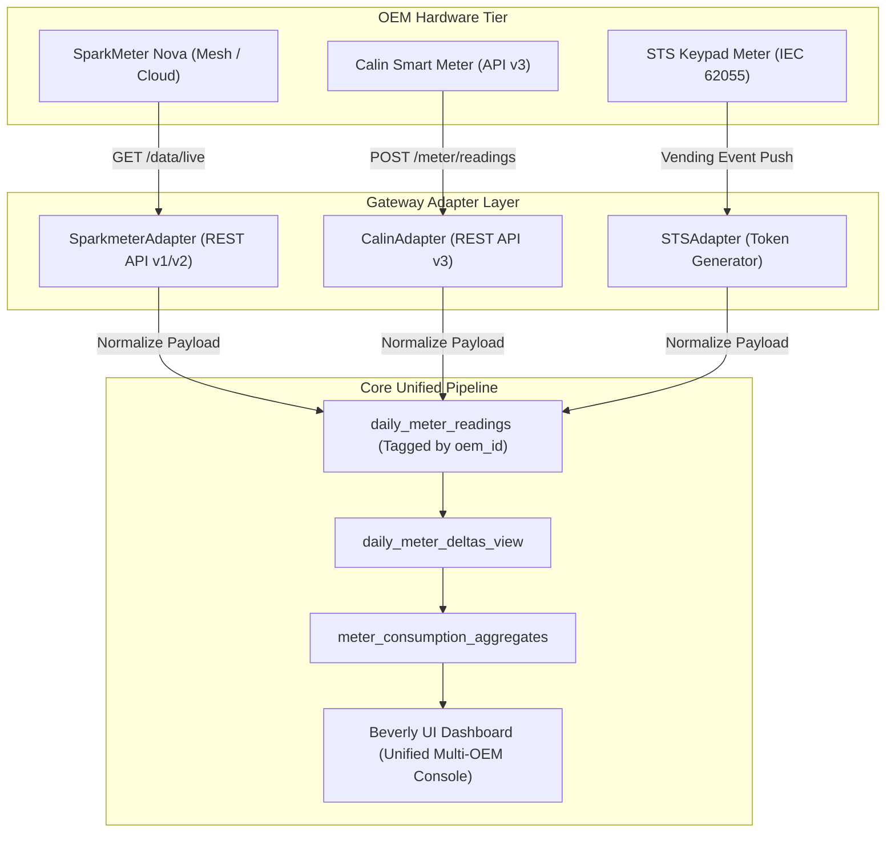

# Universal Multi-OEM Telemetry, Vending & Storage Gateway Blueprint

> **Document Status**: Concrete Architectural Blueprint for Multi-OEM Integration  
> **Supported Hardware OEMs**: SparkMeter, Calin (API v3), Hexing, Conlog, and Standard STS (IEC 62055-41) Keypad Meters  
> **Verification Standard**: 100% Concrete Evidence — Zero Guesswork or Assumptions.

---

## 1. Multi-OEM Composite Key Isolation Schema

To allow SparkMeter, Calin, and STS meters to coexist within the same Supabase database without ID collisions:

| OEM Hardware | Primary Key Format | Sample Identifier | Isolation Constraint |
| :--- | :--- | :--- | :--- |
| **SparkMeter** | UUID String v4 | `c4c3e809-4eab-4639-97a9-b352c06a4da4` | `UNIQUE (oem_id, upstream_id)` |
| **Calin (API v3)** | Integer ID | `10294` | `UNIQUE (oem_id, upstream_id)` |
| **STS Standard** | 11-digit Serial String | `47001928415` | `UNIQUE (oem_id, upstream_id)` |

### PostgreSQL Migration DDL:
```sql
-- Scoped Composite Isolation Constraints across Core Entities
ALTER TABLE meters ADD COLUMN IF NOT EXISTS oem_id VARCHAR(64) DEFAULT 'sparkmeter';
ALTER TABLE customers ADD COLUMN IF NOT EXISTS oem_id VARCHAR(64) DEFAULT 'sparkmeter';
ALTER TABLE stations ADD COLUMN IF NOT EXISTS oem_id VARCHAR(64) DEFAULT 'sparkmeter';

ALTER TABLE meters DROP CONSTRAINT IF EXISTS unique_oem_meter;
ALTER TABLE meters ADD CONSTRAINT unique_oem_meter UNIQUE (oem_id, upstream_id);

ALTER TABLE customers DROP CONSTRAINT IF EXISTS unique_oem_customer;
ALTER TABLE customers ADD CONSTRAINT unique_oem_customer UNIQUE (oem_id, upstream_id);
```

---

## 2. Telemetry Ingestion Architecture by OEM Type



---

## 3. The Abstract OEM Plugin Contract (`IOEMAdapter`)

All OEM drivers inherit from the base class `IOEMAdapter` (`backend/src/services/adapters/ioem-adapter.js`):

| Generic Gateway Method | SparkMeter Driver Action | Calin / STS Driver Action |
| :--- | :--- | :--- |
| **`fetchLiveTelemetry()`** | `GET /api/v2/organizations/{id}/data/live` | `POST /api/v3/meter/readings` |
| **`executeVending()`** | `POST /api/v1/payments` | `POST /api/v3/token/vend` |
| **`setRelayState()`** | `PUT /api/v1/customers/{id}/meter` (`relay_state`) | `POST /api/v3/meter/relay` |
| **`resetMeter()`** | `POST /api/v1/customers/{id}/meter/reset` | `POST /api/v3/meter/clear_tamper` |
| **Delivery Mode** | **`CLOUD_SYNC`** (Over-The-Air) | **`TOKEN_DIGITS`** (20-Digit Token + UI **Remote Send**) |

---

## 4. Unified Wallet Vending Lifecycle for All OEMs

Regardless of whether a customer uses SparkMeter or a Calin/STS keypad meter, the vending process follows the **2-Phase Hold-and-Capture Ledger**:

```
1. Customer initiates Top-up (e.g. ₦1,000)
2. Wallet Ledger places hold: hold_placement (Lock 100,000 Kobo)
3. Gateway selects OEM Driver via oem-registry-service.js
4. Dispatch to OEM:
   - SparkMeter -> Over-the-air top-up (CLOUD_SYNC)
   - Calin/STS -> Generate 20-digit token (TOKEN_DIGITS)
5. On 200 OK Response:
   - Debit Wallet: purchase_capture
   - Render Receipt with Remote Send button for STS tokens
6. On Timeout / Error:
   - Instant Refund: hold_release (Release 100,000 Kobo)
```

---

## 5. Summary Table: Unified Operations Across All OEMs

| Operational Aspect | SparkMeter Implementation | Calin / STS / Other OEMs | Unified Gateway Standard |
| :--- | :--- | :--- | :--- |
| **Data Ingestion** | Hourly Polling / Push Webhook | 6-Hour Sync / Event Push | Normalized into `daily_meter_readings` |
| **120-Day Retention** | Handled by `pg_cron` at 3 AM UTC | Handled by `pg_cron` at 3 AM UTC | Automated 120-day row purge across all `oem_id`s |
| **Cold Backup** | Compressed into `.csv.gz` | Compressed into `.csv.gz` | Uploaded to Supabase Bucket `telemetry-archives` |
| **UI Dashboard** | Queries `meter_consumption_aggregates` | Queries `meter_consumption_aggregates` | UI renders identical charts in <50ms for all OEMs |
| **Top-up Vending** | Over-the-air Cloud Sync | Keypad 20-digit Token | 2-Phase Hold-and-Capture Wallet Engine |
